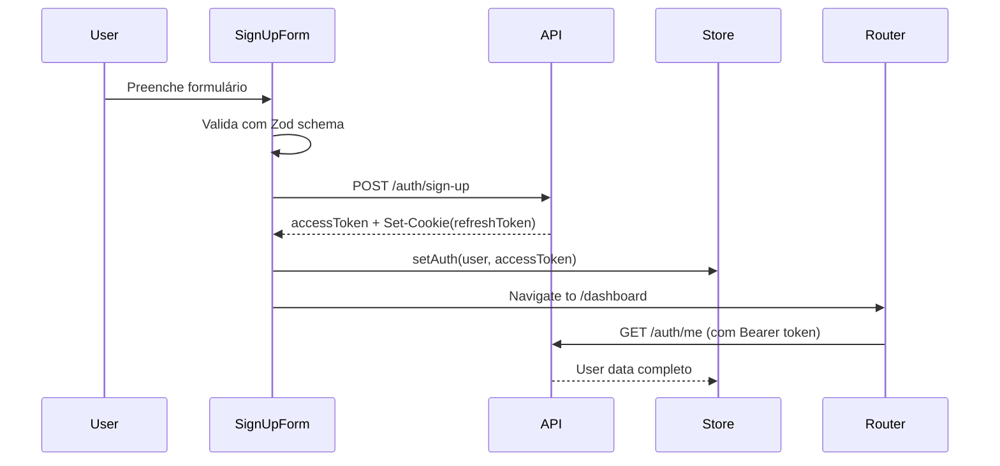
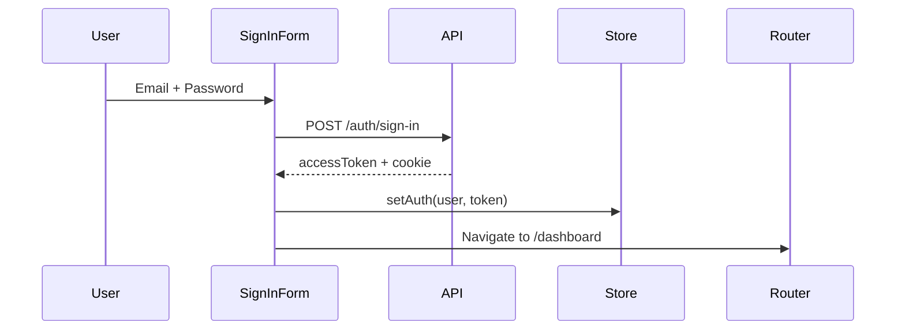
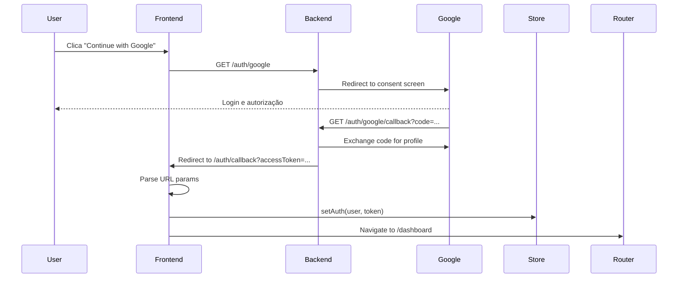
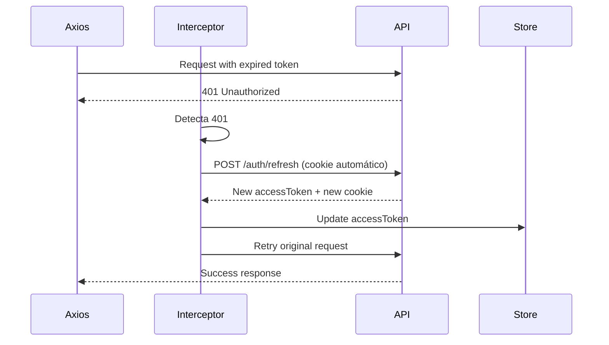
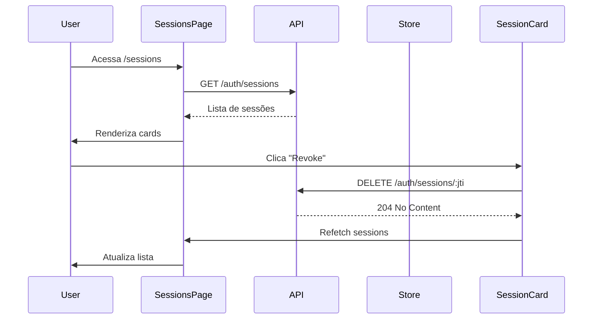
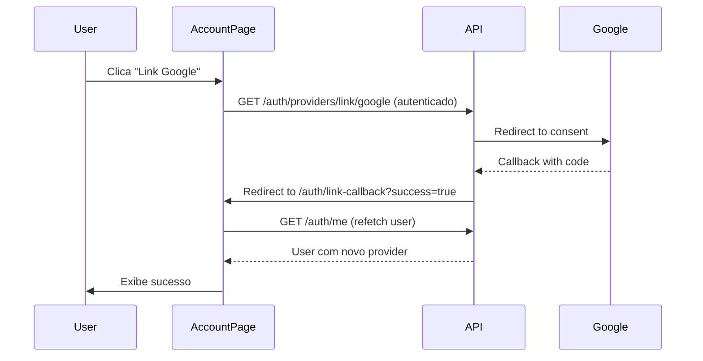

# Auth Feature - Design Specification

## 🎯 Visão Geral

Implementação completa do módulo de autenticação no frontend, integrando com a API REST do backend. Suporta autenticação por email/senha e OAuth Google, com gerenciamento de múltiplas sessões e vinculação de providers.

## 📐 Arquitetura

### Feature-based Structure

```
src/features/auth/
├── api/                    # Chamadas à API
│   ├── auth.api.ts        # Axios client configurado
│   ├── mutations.ts       # React Query mutations (sign-up, sign-in, logout)
│   └── queries.ts         # React Query queries (get-me, sessions)
├── components/            # Componentes organizados por Atomic Design
│   ├── atoms/            # Button, Input, Label, ErrorMessage
│   ├── molecules/        # FormField (Label+Input+Error), SocialButton
│   ├── organisms/        # SignUpForm, SignInForm, SessionCard
│   └── templates/        # AuthLayout (structure for auth pages)
├── hooks/                # Custom hooks
│   ├── useAuth.ts       # Hook principal de autenticação
│   ├── useRefreshToken.ts # Auto-refresh de tokens
│   └── useOAuthCallback.ts # Handle OAuth callbacks
├── stores/               # Zustand stores
│   └── auth.store.ts    # Estado global de autenticação
├── types/                # TypeScript types
│   ├── auth.types.ts    # User, SignUpDto, SignInDto, Session
│   └── oauth.types.ts   # OAuthProvider, OAuthState
├── utils/                # Utilities
│   ├── token.utils.ts   # JWT decode, validate
│   ├── oauth.utils.ts   # OAuth flow helpers
│   └── validation.ts    # Zod schemas
└── pages/                # Route pages
    ├── SignUpPage.tsx
    ├── SignInPage.tsx
    ├── OAuthCallbackPage.tsx
    ├── SessionsPage.tsx
    └── LinkProviderPage.tsx
```

## 🔐 Fluxos de Autenticação

### 1. Sign Up (Email/Senha)



**Componentes envolvidos:**
- `SignUpPage` (page) → renderiza template
- `AuthLayout` (template) → estrutura com logo/imagem lateral
- `SignUpForm` (organism) → formulário completo com lógica
- `FormField` (molecule) → campo individual (label+input+error)
- `Button`, `Input`, `Label`, `ErrorMessage` (atoms)

**Validação (Zod):**
```typescript
const signUpSchema = z.object({
  userName: z.string().min(3).max(20),
  email: z.string().email(),
  password: z.string().min(8).regex(/[A-Z]/).regex(/[0-9]/),
  firstName: z.string().min(2),
  lastName: z.string().min(2)
});
```

**Estados:**
- `idle` - Formulário limpo
- `validating` - Validação em tempo real
- `submitting` - Enviando para API
- `success` - Redirecionando
- `error` - Exibindo erro

### 2. Sign In (Email/Senha)



**Diferenças do Sign Up:**
- Validação mais simples (apenas email/password)
- Não possui campos de nome
- Inclui opção "Remember me" (controla duração do cookie)
- Link para "Forgot password"
- Divisor visual "OR" entre email/senha e OAuth

### 3. OAuth Google



**Componentes:**
- `SocialButton` (molecule) → botão estilizado com logo Google
- `OAuthCallbackPage` (page) → processa callback e redireciona
- `useOAuthCallback` (hook) → extrai token da URL

**Tratamento de erros:**
- `access_denied` - Usuário cancelou no Google
- `invalid_state` - Possível ataque CSRF
- `user_cancelled` - Usuário fechou popup

### 4. Refresh Token Rotation



**Implementação:**
```typescript
// Axios interceptor que trata 401
axios.interceptors.response.use(
  response => response,
  async error => {
    if (error.response?.status === 401 && !error.config._retry) {
      error.config._retry = true;
      const newToken = await refreshToken();
      error.config.headers.Authorization = `Bearer ${newToken}`;
      return axios(error.config);
    }
    return Promise.reject(error);
  }
);
```

**Casos especiais:**
- Refresh token expirado → Logout automático
- Múltiplas requests simultâneas → Queue pattern
- Race condition → Lock com Promise.race

### 5. Gerenciamento de Sessões



**Componentes:**
- `SessionsPage` (page)
- `SessionsList` (organism) - lista com infinite scroll
- `SessionCard` (organism) - card individual com botão revoke
- `DeviceIcon` (atom) - ícone baseado no user agent
- `SessionMetadata` (molecule) - IP, localização, data

**Metadata exibida:**
- Dispositivo (icon + nome: "Chrome on Windows")
- Localização (cidade, país)
- IP address (parcial: "192.168.***.***")
- Última atividade ("Active now" ou "2 hours ago")
- Sessão atual (badge "Current")

### 6. Vinculação de Providers



**Fluxo de Email:**
```typescript
// Adicionar email/senha a conta Google
POST /auth/providers/link/email
{
  "email": "john@example.com",
  "password": "senha123"
}
```

**UI:**
- Página "Account Settings"
- Seção "Connected Accounts"
- Cards para cada provider (email, Google)
- Botão "Link" se não conectado
- Badge "Connected" + botão "Unlink" se conectado

## 🗃️ Estado Global (Zustand)

```typescript
interface AuthState {
  // State
  user: User | null;
  accessToken: string | null;
  isAuthenticated: boolean;
  isLoading: boolean;
  
  // Actions
  setAuth: (user: User, accessToken: string) => void;
  updateUser: (user: Partial<User>) => void;
  logout: () => void;
  clearAuth: () => void;
}
```

**Persistência:**
- `accessToken` → sessionStorage (limpa ao fechar aba)
- `user` → sessionStorage
- Refresh token → HttpOnly cookie (backend gerencia)

**Sincronização:**
- localStorage event listener para sync entre abas
- Logout em uma aba → logout em todas

## 🔧 TanStack Query Configuration

```typescript
const queryClient = new QueryClient({
  defaultOptions: {
    queries: {
      staleTime: 5 * 60 * 1000, // 5 minutos
      cacheTime: 10 * 60 * 1000, // 10 minutos
      retry: 1,
      refetchOnWindowFocus: false,
    },
    mutations: {
      retry: 0,
    },
  },
});
```

**Queries:**
- `useUser` - GET /auth/me
- `useSessions` - GET /auth/sessions

**Mutations:**
- `useSignUp` - POST /auth/sign-up
- `useSignIn` - POST /auth/sign-in
- `useLogout` - POST /auth/logout
- `useRefresh` - POST /auth/refresh
- `useRevokeSession` - DELETE /auth/sessions/:jti
- `useLinkEmail` - POST /auth/providers/link/email

## 🎨 Design System (Silicon Valley UX)

### Cores (Autenticação)

```typescript
// Trust colors - blues/greens
const colors = {
  primary: {
    DEFAULT: 'hsl(221, 83%, 53%)', // Blue-600
    hover: 'hsl(221, 83%, 45%)',
  },
  success: {
    DEFAULT: 'hsl(142, 71%, 45%)', // Green-600
  },
  danger: {
    DEFAULT: 'hsl(0, 72%, 51%)', // Red-600
  },
  neutral: {
    bg: 'hsl(0, 0%, 98%)', // Gray-50
    border: 'hsl(214, 14%, 88%)', // Gray-200
  }
};
```

### Tipografia

```css
/* Headings - Manrope (geometric, friendly) */
h1 { font-size: 2.5rem; font-weight: 700; }
h2 { font-size: 2rem; font-weight: 600; }

/* Body - Inter (legible, neutral) */
body { font-size: 1rem; font-weight: 400; }

/* Inputs - Monospace for emails */
input[type="email"] { font-family: 'JetBrains Mono'; }
```

### Componentes de Autenticação

**SignUpForm:**
- Layout vertical com espaçamento generoso
- Inputs com labels flutuantes
- Validação em tempo real (debounce 300ms)
- Feedback visual imediato (✓ ou ✗)
- Botão submit desabilitado se inválido
- Loading state com spinner
- Divisor "OR" antes de OAuth buttons

**SocialButton:**
- Logo do provider (Google SVG oficial)
- Texto: "Continue with Google"
- Border com hover state
- Ripple effect no clique
- Focus ring para acessibilidade

**FormField:**
- Label com asterisco se required
- Input com border-focus animation
- Error message com slide-down animation
- Helper text abaixo do input
- Icon prefix (envelope para email, lock para password)

## 🛡️ Segurança

### Headers HTTP

```typescript
// Axios defaults
axios.defaults.withCredentials = true; // Envia cookies
axios.defaults.headers.common['X-Requested-With'] = 'XMLHttpRequest';
```

### Token Storage

- ❌ **NÃO usar localStorage** para accessToken (XSS vulnerable)
- ✅ **Usar sessionStorage** (limpa ao fechar aba, mais seguro)
- ✅ **HttpOnly cookies** para refreshToken (backend gerencia)

### CSRF Protection

- Refresh token em HttpOnly cookie → protegido contra XSS
- SameSite=Lax em produção → protegido contra CSRF
- State parameter no OAuth → protege callback

### Input Validation

```typescript
// Sanitização de inputs
const sanitize = (input: string) => {
  return input.trim().replace(/[<>]/g, '');
};

// Password strength
const passwordStrength = (pwd: string) => {
  const hasUpper = /[A-Z]/.test(pwd);
  const hasLower = /[a-z]/.test(pwd);
  const hasNumber = /[0-9]/.test(pwd);
  const hasSpecial = /[^A-Za-z0-9]/.test(pwd);
  const isLongEnough = pwd.length >= 8;
  
  return { hasUpper, hasLower, hasNumber, hasSpecial, isLongEnough };
};
```

## 📱 Responsividade

### Breakpoints

```typescript
const breakpoints = {
  sm: '640px',  // Mobile landscape
  md: '768px',  // Tablet
  lg: '1024px', // Desktop
  xl: '1280px', // Wide desktop
};
```

### Layout Adaptativo

**Desktop (≥ 1024px):**
```
┌────────────────────────────────────┐
│  Image/Illustration │  Auth Form   │
│  (50%)              │  (50%)       │
│                     │              │
└────────────────────────────────────┘
```

**Mobile (< 1024px):**
```
┌──────────────┐
│  Auth Form   │
│  (100%)      │
│              │
└──────────────┘
```

## 🧪 Estados e Edge Cases

### Loading States

1. **Initial load** - Skeleton do formulário
2. **Submitting** - Botão com spinner, inputs disabled
3. **OAuth redirect** - Fullscreen spinner com mensagem
4. **Fetching user** - Skeleton do avatar/nome

### Error States

1. **Validation errors** - Inline, em tempo real
2. **API errors** - Toast notification no topo
3. **Network errors** - Retry button
4. **OAuth errors** - Mensagem na página de callback

### Empty States

1. **No sessions** - Ilustração + texto "Only this device is connected"
2. **No providers** - CTA para "Add another sign-in method"

### Success States

1. **Sign up success** - Redirect to onboarding
2. **Sign in success** - Redirect to dashboard
3. **Provider linked** - Toast + refetch user data
4. **Session revoked** - Remove card com fade-out

## ♿ Acessibilidade

### ARIA Labels

```tsx
<form aria-label="Sign in form">
  <input 
    type="email"
    aria-label="Email address"
    aria-required="true"
    aria-invalid={!!errors.email}
    aria-describedby="email-error"
  />
  {errors.email && (
    <span id="email-error" role="alert">
      {errors.email.message}
    </span>
  )}
</form>
```

### Keyboard Navigation

- Tab order lógico (email → senha → botão)
- Enter submete formulário
- Escape fecha modais
- Focus visible em todos os elementos interativos

### Screen Readers

- Labels claros em todos os inputs
- Mensagens de erro anunciadas com role="alert"
- Loading states anunciados com aria-live
- Success/error toasts com role="status"

## 📊 Analytics Events

```typescript
// Sign Up
analytics.track('sign_up_started');
analytics.track('sign_up_completed', { provider: 'email' });
analytics.track('sign_up_failed', { error: 'email_exists' });

// Sign In
analytics.track('sign_in_started', { provider: 'google' });
analytics.track('sign_in_completed', { provider: 'google' });

// Sessions
analytics.track('session_revoked', { jti: '...' });
analytics.track('sessions_viewed');

// Provider Linking
analytics.track('provider_link_started', { provider: 'google' });
analytics.track('provider_link_completed', { provider: 'google' });
```

## 🔄 Sincronização Entre Abas

```typescript
// Listener para logout em outras abas
window.addEventListener('storage', (event) => {
  if (event.key === 'auth_logout') {
    // Limpa estado e redireciona
    authStore.clearAuth();
    navigate('/sign-in');
  }
});

// Trigger logout em todas as abas
const logoutAllTabs = () => {
  localStorage.setItem('auth_logout', Date.now().toString());
  localStorage.removeItem('auth_logout'); // Cleanup
};
```

## 🚀 Performance

### Code Splitting

```typescript
// Lazy load páginas de autenticação
const SignUpPage = lazy(() => import('./pages/SignUpPage'));
const SignInPage = lazy(() => import('./pages/SignInPage'));
const SessionsPage = lazy(() => import('./pages/SessionsPage'));
```

### Optimistic Updates

```typescript
// Revogar sessão com optimistic update
const { mutate } = useRevokeSession({
  onMutate: async (jti) => {
    await queryClient.cancelQueries(['sessions']);
    const previous = queryClient.getQueryData(['sessions']);
    
    queryClient.setQueryData(['sessions'], (old) =>
      old.filter(s => s.jti !== jti)
    );
    
    return { previous };
  },
  onError: (err, variables, context) => {
    queryClient.setQueryData(['sessions'], context.previous);
  },
});
```

### Debouncing

```typescript
// Validação de email em tempo real
const debouncedCheckEmail = useDebouncedCallback(
  async (email: string) => {
    const exists = await checkEmailExists(email);
    if (exists) setError('email', { message: 'Email already in use' });
  },
  500 // 500ms delay
);
```

## 🧩 Integração com Backend

### Base URL Configuration

```typescript
// .env.development
VITE_API_BASE_URL=http://localhost:3000

// .env.production
VITE_API_BASE_URL=https://api.personalfinance.com
```

### CORS Settings

Backend deve permitir:
```typescript
{
  origin: ['http://localhost:5173', 'https://app.personalfinance.com'],
  credentials: true, // Para cookies HttpOnly
  methods: ['GET', 'POST', 'PUT', 'DELETE'],
  allowedHeaders: ['Content-Type', 'Authorization'],
}
```

### Rate Limiting Handling

```typescript
// Detecta 429 Too Many Requests
if (error.response?.status === 429) {
  const retryAfter = error.response.headers['retry-after'];
  toast.error(`Too many attempts. Please wait ${retryAfter} seconds.`);
  
  // Opcional: implementar exponential backoff
  await sleep(parseInt(retryAfter) * 1000);
  return retry();
}
```

## 📝 Notas de Implementação

1. **Ordem de criação:**
   - Atoms → Molecules → Organisms → Templates → Pages
   - Types → API client → Hooks → Components → Pages

2. **Testing:**
   - Unit tests para validação (Zod schemas)
   - Integration tests para fluxos completos
   - E2E tests para OAuth flow

3. **Documentação:**
   - JSDoc em hooks complexos
   - Storybook para componentes isolados
   - README em cada feature

4. **Migrations:**
   - Se já existe auth legado, criar migration guide
   - Manter backward compatibility durante transição

## 🎯 Critérios de Sucesso

- [ ] Usuário consegue criar conta com email/senha
- [ ] Usuário consegue fazer login com email/senha
- [ ] Usuário consegue fazer login com Google OAuth
- [ ] Tokens são renovados automaticamente antes de expirar
- [ ] Usuário consegue visualizar sessões ativas
- [ ] Usuário consegue revogar sessões
- [ ] Usuário consegue vincular múltiplos providers
- [ ] Logout funciona corretamente (limpa tokens)
- [ ] Interface é responsiva (mobile/tablet/desktop)
- [ ] Acessível (WCAG AA)
- [ ] Loading states em todas as ações assíncronas
- [ ] Error handling robusto com mensagens claras
