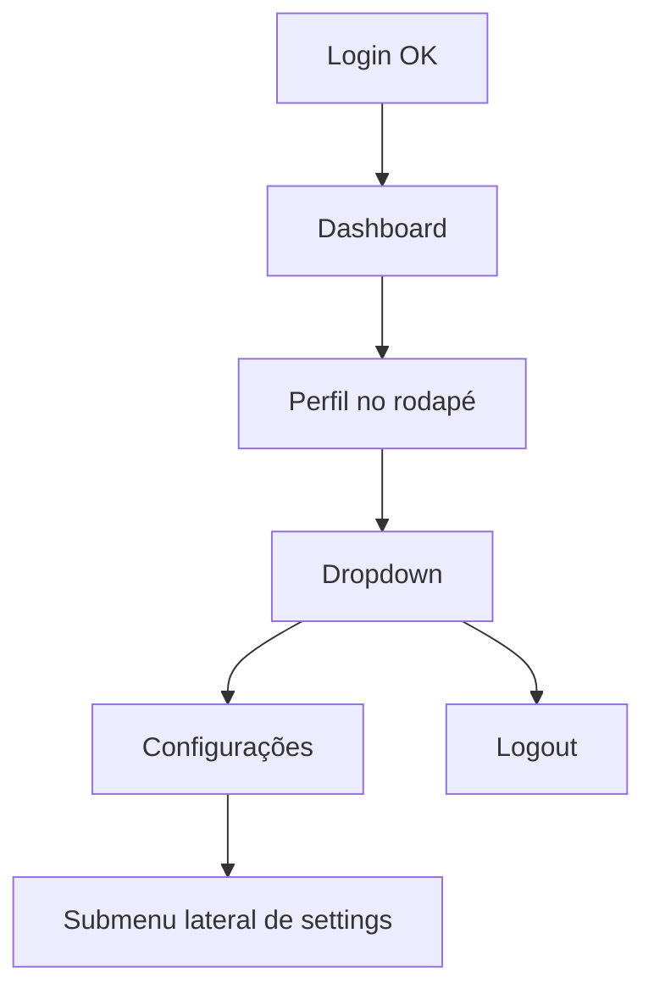
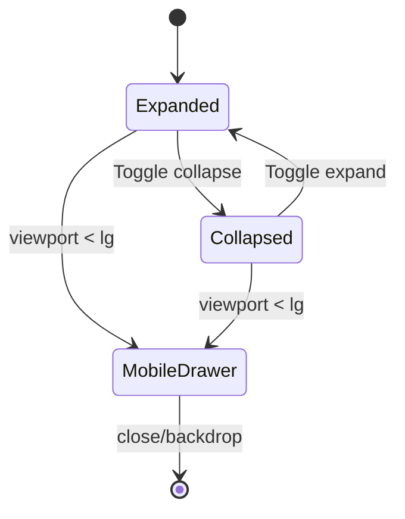

# Auth Shell v2 - Design Specification

## 🎯 Visão Geral

Este spec define a correção completa da área autenticada do **Danfy Finance**, com foco em:

1. Navegação lateral correta (fixa, responsiva e colapsável para modo ícone).
2. Entrada de **Configurações apenas via menu de perfil** (não no menu principal).
3. Exibição real de dados do usuário no perfil.
4. Conteúdo de Segurança com dados concretos (sessões ativas e ações).
5. Consumo do backend que já existe + definição do gap de contrato para “métodos vinculados”.

---

## 🚨 Problemas identificados

1. Sidebar principal não segue o comportamento esperado (faltando colapso para ícones).
2. Menu principal exibindo item de Configurações (fora do fluxo desejado).
3. Perfil sem superfície clara de dados úteis do usuário.
4. Área de Segurança sem informações funcionais.
5. Submenu de configurações com nomenclatura genérica (“submenu”).
6. Header e hierarquia visual não alinhados ao padrão do produto.
7. Estado de providers de login não pode ser inferido corretamente apenas com o contrato atual.

---

## ✅ Objetivos funcionais

1. **Shell autenticado único** para Dashboard e Settings.
2. **Sidebar principal**:
   - fixa no desktop;
   - drawer no mobile;
   - com botão de colapso (`expandido` ↔ `ícone`).
3. **Navegação principal somente com “Painel”**.
4. **Configurações acessível via dropdown do perfil**.
5. **Bloco de perfil** no rodapé da sidebar com:
   - avatar/initials;
   - nome;
   - email;
   - menu com ações.
6. **Página de Configurações** com submenu lateral nomeado por domínio:
   - Conta
   - Segurança
   - Notificações
   - Preferências
7. **Segurança funcional** consumindo backend:
   - listar sessões;
   - marcar sessão atual;
   - revogar sessão.

---

## ❌ Fora de escopo (nesta iteração)

1. Fluxo visual final de “Vincular métodos de login” com estados conectados/desconectados.
2. Unlink de provider.
3. Avatar remoto (foto de perfil real) sem endpoint dedicado.

> Motivo: o backend atual não expõe metadados de providers no contrato de leitura de usuário.

---

## 🧱 Arquitetura proposta (Atomic Design)

```
src/features/auth/
├── components/
│   ├── atoms/
│   ├── molecules/
│   ├── organisms/
│   └── templates/
│       ├── AuthAppShell.tsx
│       ├── DashboardPage.tsx
│       └── SettingsPage.tsx
├── api/
│   ├── auth.api.ts
│   ├── queries.ts
│   └── mutations.ts
├── constants/
│   └── auth.constants.ts
└── utils/
    └── error.utils.ts
```

---

## 🧭 Navegação e fluxo UX

### Fluxo principal



### Comportamento da sidebar



---

## 🖼️ Especificação de layout

## 1) Sidebar principal (desktop)

- `position: fixed; inset-y: 0; left: 0`
- estados:
  - **Expandida**: largura ~272px
  - **Colapsada (ícone)**: largura ~88px
- conteúdo:
  - topo com marca
  - navegação principal (somente Painel)
  - rodapé com perfil e dropdown

### Regras de conteúdo
- Em colapsado:
  - manter ícones;
  - esconder labels longas;
  - manter tooltips/aria-label.

## 2) Mobile

- sidebar vira drawer lateral sobreposto;
- backdrop clicável para fechar;
- sem scroll quebrado no body.

## 3) Header

- minimalista;
- título da seção + subtítulo curto;
- sem texto técnico, sem referência a endpoint.

## 4) Settings

- layout de duas colunas no desktop:
  - submenu lateral da configuração;
  - conteúdo da seção ativa.
- no mobile: submenu vira lista acima do conteúdo.

---

## 👤 Perfil (rodapé da sidebar)

### Dados obrigatórios visíveis
- `fullName` (ou fallback `userName`/`email`)
- `email`
- `initials` derivadas do nome

### Fonte de dados
- `GET /auth/me`

### Ações do dropdown
1. Abrir Configurações
2. Logout

> Configurações **não** aparece no menu principal da sidebar.

---

## 🔒 Seção Segurança (Settings > Segurança)

### Dados exibidos
- Lista de sessões ativas (`GET /auth/sessions`)
- Badge de sessão atual (via `jti` do access token)
- Dispositivo, browser, OS, localização, IP mascarado, data de login

### Ações
- Revogar sessão específica (`DELETE /auth/sessions/:jti`)

### Estado vazio
- Mensagem clara quando não houver sessões além da atual.

---

## 🔌 Matriz de consumo backend

| Domínio | Endpoint | Uso na UI | Status |
|---|---|---|---|
| Perfil | `GET /users/me` | Nome/email/avatar fallback | ✅ disponível |
| Sessões | `GET /auth/sessions` | Segurança > lista de sessões | ✅ disponível |
| Sessões | `DELETE /auth/sessions/:jti` | Segurança > revogar | ✅ disponível |
| Sessão | `POST /auth/logout` | Dropdown perfil > sair | ✅ disponível |
| Providers | `GET /users/me` (`providers[]`) | Métodos vinculados | ✅ disponível |

---

## 🧩 Gap remanescente: método de login atual

Com `GET /users/me` retornando `providers[]`, o frontend já consegue exibir os métodos vinculados.

O ponto ainda opcional para UX avançada é o **método usado na sessão atual**. Para isso, é necessário um campo adicional como:

- `currentProvider` no payload de `GET /users/me`; ou
- claim equivalente no access token.

---

## 🎨 Design System & regras obrigatórias

### Tokens de cor (obrigatório)
- Todas as cores devem vir de:
  - `src/index.css` (`--app-*`, `--brand-*`, `--state-*`)
  - `tailwind.config.js` (`app`, `brand`, `state`)

### Proibições
- Sem `#hex`, `rgb`, `rgba`, `hsl` inline em componentes.
- Sem paleta hardcoded (`text-slate-*`, `bg-violet-*`, etc.) para UI final.

### Instruções formais
- `.github/instructions/color-governance.instructions.md`
- `.github/instructions/typescript-safety.instructions.md`
- `.github/instructions/silicon-valley-ux.instructions.md`
- `.github/instructions/atomic-design.instructions.md`

---

## 🔐 TypeScript & erro resiliente

1. `unknown` apenas com narrowing imediato.
2. Proibido acessar erro sem validação de shape.
3. Sem `as any`.
4. Rotas/endpoints/eventos/query keys em constantes.

---

## ♿ Acessibilidade e responsividade

1. Navegação por teclado em sidebar e dropdown.
2. `aria-expanded`, `aria-haspopup`, `aria-label` em ações de menu.
3. Targets de toque mínimos no mobile.
4. Contraste AA para texto principal e estados de ação.

---

## ✅ Critérios de aceite

1. Sidebar desktop pode alternar entre expandida e ícone.
2. Configurações não aparece no menu principal; somente no dropdown do perfil.
3. Perfil mostra nome/email reais do usuário autenticado.
4. Página de configurações possui submenu nomeado por domínio (sem rótulo genérico).
5. Segurança mostra sessões reais e revogação funcional.
6. UI sem exposição de termos técnicos de rota/endpoint.
7. Cores da feature seguem exclusivamente tokens semânticos.
8. Parsing de erro e eventos sem acessos frágeis de propriedades.
