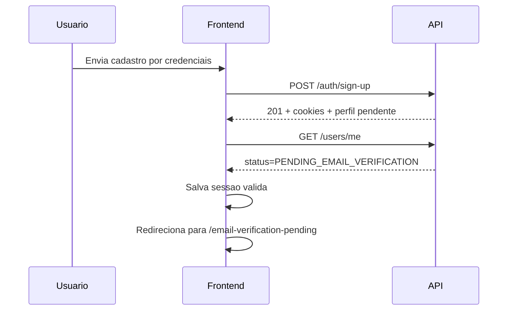
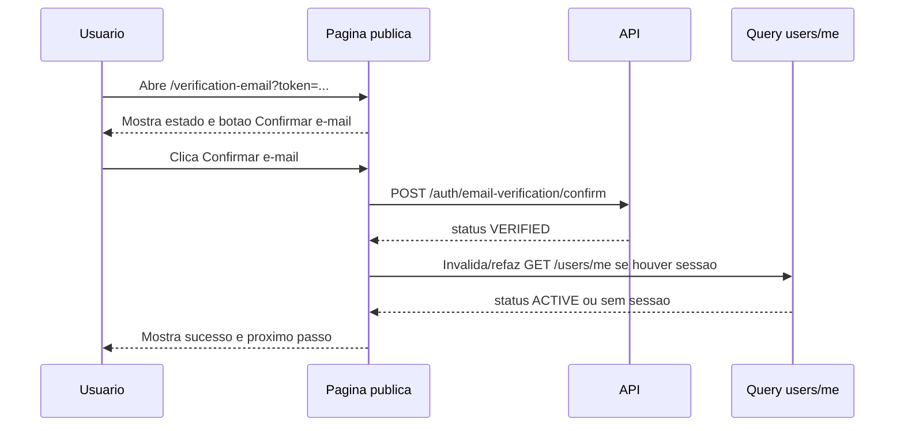

# Email Verification Frontend - Design Specification

## Visao Geral

Esta spec define o fluxo frontend de verificacao de e-mail para contas criadas por credenciais no Danfy Finance.

Usuarios criados por e-mail e senha passam a autenticar normalmente, recebem sessao/cookies HttpOnly e retornam em `GET /users/me` com `status = PENDING_EMAIL_VERIFICATION`. Enquanto estiverem pendentes, a sessao continua valida, mas os recursos principais do produto ficam bloqueados ate a confirmacao do e-mail.

Usuarios Google/OAuth ficam fora desta iteracao.

## Fontes De Verdade

- `AGENTS.md`
- `.agents/skills/danfy-api-error-handling/SKILL.md`
- `.agents/skills/frontend-design/SKILL.md`
- `.agents/skills/danfy-finance-design-system/SKILL.md`
- `docs/design-system/danfy-finance-design-system.md`
- `docs/design-system/material-3-reference.md`
- `../personal-finance-backend/docs/integrations/errors.md`
- `../personal-finance-backend/docs/integrations/auth/sign-up.md`
- `../personal-finance-backend/docs/integrations/auth/get-me.md`
- `../personal-finance-backend/docs/integrations/auth/email-verification.md`
- `../personal-finance-backend/docs/specs/auth/email-verification/specs/requirements.md`
- `../personal-finance-backend/docs/specs/auth/email-verification/specs/design.md`
- `../personal-finance-backend/docs/notifications/README.md`
- `../personal-finance-backend/docs/notifications/email-templates/email-verification.md`

## Objetivos

1. Criar rota publica `/verification-email?token=<token>` para receber links do e-mail transacional.
2. Exigir uma acao explicita do usuario para confirmar o e-mail. A pagina nao deve confirmar apenas por abrir.
3. Criar uma tela autenticada de e-mail pendente para usuarios `PENDING_EMAIL_VERIFICATION`.
4. Bloquear acesso aos recursos principais quando o perfil estiver pendente, preservando sessao e cookies.
5. Permitir reenvio autenticado respeitando cooldown e limite diario documentados.
6. Sincronizar `GET /users/me` apos login, sign-up, confirmacao e erros de autorizacao relacionados.
7. Tratar `EMAIL_VERIFICATION_REQUIRED` como estado valido de sessao pendente, nao como logout.
8. Apresentar erros com copy acionavel em portugues, sem expor mensagens/codigos tecnicos do backend.

## Fora De Escopo

1. Implementar codigo nesta spec.
2. Alterar backend.
3. Verificacao para usuarios Google/OAuth.
4. Troca de e-mail principal.
5. Recuperacao de senha.
6. MFA.
7. Painel administrativo de challenges ou e-mails.

## Rotas Propostas

| Rota | Acesso | Finalidade |
| --- | --- | --- |
| `/verification-email?token=<token>` | Publica | Confirmar token vindo do e-mail apos acao explicita do usuario. |
| `/email-verification-pending` | Autenticada | Estado bloqueante para usuario logado com e-mail pendente. |

Observacao: a rota pendente pode usar outro slug se o roteamento existente preferir padrao diferente, mas deve ser uma rota dedicada e constante, nao um estado escondido no dashboard.

## Contratos De API

### GET /users/me

Uso:

- sempre apos login;
- sempre apos sign-up;
- apos confirmacao bem-sucedida;
- apos receber `EMAIL_VERIFICATION_REQUIRED` em endpoint protegido;
- ao carregar a aplicacao autenticada.

Status relevante:

- `ACTIVE`: liberar navegacao normal.
- `PENDING_EMAIL_VERIFICATION`: redirecionar para a experiencia de verificacao pendente.
- outros status: manter a logica existente.

### POST /auth/email-verification/confirm

Auth: publica.

Body:

```json
{
  "token": "token-completo-da-url"
}
```

Sucesso `200`:

```json
{
  "object": "email_verification.confirmation",
  "status": "VERIFIED"
}
```

Regras frontend:

- extrair `token` de `/verification-email?token=<token>`;
- nao confirmar automaticamente no mount da pagina;
- renderizar CTA primario `Confirmar e-mail`;
- enviar o token somente apos clique/submit do usuario;
- se houver sessao ativa, invalidar/refazer `GET /users/me` apos sucesso;
- se `GET /users/me` retornar `ACTIVE`, liberar navegacao normal;
- se nao houver sessao ativa, mostrar sucesso e oferecer entrada no app.

### POST /auth/email-verification/resend

Auth: cookies HttpOnly da sessao atual.

Body:

```json
{}
```

Sucesso `202`:

```json
{
  "object": "email_verification.resend",
  "status": "QUEUED"
}
```

Usuario ja verificado:

```json
{
  "object": "email_verification.resend",
  "status": "ALREADY_VERIFIED"
}
```

Regras frontend:

- chamar somente em contexto autenticado;
- nao solicitar e-mail em formulario;
- usar a sessao atual como destinatario;
- ao receber `QUEUED`, mostrar estado persistente de envio feito;
- apos sucesso, aplicar cooldown local de 60 minutos se viavel;
- ao receber `ALREADY_VERIFIED`, refazer `GET /users/me` e liberar navegacao se o perfil estiver `ACTIVE`.

## Inventario De Erros E UX

| Codigo | Endpoint/Origem | Superficie | Copy e Recuperacao |
| --- | --- | --- | --- |
| `EMAIL_VERIFICATION_REQUIRED` | Endpoints protegidos | Redirecionamento para tela pendente com alerta inline | "Confirme seu e-mail para continuar". Manter sessao, refazer `GET /users/me` e bloquear recursos principais. |
| `EMAIL_VERIFICATION_TOKEN_INVALID` | Confirm | Alerta inline na pagina publica | "Este link nao pode ser usado". Orientar entrar na conta e solicitar novo envio. |
| `EMAIL_VERIFICATION_TOKEN_EXPIRED` | Confirm | Alerta inline na pagina publica | "Este link expirou". Se houver sessao pendente, oferecer reenvio; se nao houver, orientar entrar novamente. |
| `EMAIL_VERIFICATION_COOLDOWN_ACTIVE` | Resend | Alerta inline na tela pendente | "Um novo e-mail ja foi solicitado recentemente". Orientar aguardar ate 60 minutos. |
| `EMAIL_VERIFICATION_DAILY_LIMIT_EXCEEDED` | Resend | Alerta inline na tela pendente | "O limite de envios de hoje foi atingido". Orientar tentar novamente mais tarde. |
| `EMAIL_VERIFICATION_USER_BLOCKED` | Confirm | Alerta inline na pagina publica | "Esta conta nao pode ser verificada agora". Orientar suporte/recuperacao definida pelo produto. |
| `VALIDATION_ERROR` | Confirm | Alerta inline | Tratar token ausente/malformado como link invalido, sem expor detalhes tecnicos. |
| `UNAUTHORIZED`, `INVALID_ACCESS_TOKEN`, `INVALID_REFRESH_TOKEN` | Resend ou `GET /users/me` | Fluxo de sessao existente | Tentar recuperacao centralizada; se falhar, enviar para login com copy de sessao encerrada. |
| `TOO_MANY_REQUESTS` | Resend fallback | Alerta inline | Orientar aguardar antes de tentar novamente. |
| `INTERNAL_SERVER_ERROR` ou erro desconhecido | Confirm/resend/profile | Alerta inline com retry seguro | "Servico indisponivel no momento". Preservar estado e oferecer tentar novamente quando a acao for segura. |
| Falha de rede/timeout | Confirm/resend/profile | Alerta inline | Explicar conexao indisponivel e oferecer retry. |

Nao expor no produto:

- codigo tecnico do backend;
- token;
- path;
- stack trace;
- mensagem bruta do backend;
- identificadores internos de challenge.

## Fluxo Apos Sign-up Credentials



Regras:

- o sign-up continua usando o fluxo atual;
- se a resposta do sign-up ja trouxer perfil pendente, ainda assim `GET /users/me` deve ser chamado para sincronizar o estado;
- o usuario nao deve ser deslogado;
- dashboard, contas, categorias, transacoes e demais recursos principais devem ficar inacessiveis.

## Fluxo Apos Login

```mermaid
flowchart TD
  A[Login OK] --> B[GET /users/me]
  B --> C{status}
  C -->|ACTIVE| D[Navegacao normal]
  C -->|PENDING_EMAIL_VERIFICATION| E[/email-verification-pending]
  C -->|outros| F[Logica existente]
```

O mesmo comportamento vale para restauracao de sessao ao abrir a aplicacao.

## Fluxo De Confirmacao Publica



Estados da pagina:

- token presente, aguardando acao;
- confirmando;
- confirmado com sessao ativa;
- confirmado sem sessao conhecida;
- token ausente/invalido;
- token expirado;
- conta bloqueada;
- erro de rede/servico indisponivel.

## Fluxo Da Tela Pendente

```mermaid
flowchart TD
  A[Usuario logado pendente] --> B[/email-verification-pending]
  B --> C[Explica que o e-mail foi enviado]
  C --> D[CTA secundario Reenviar e-mail]
  D --> E{POST resend}
  E -->|QUEUED| F[Mostrar envio feito e cooldown local]
  E -->|ALREADY_VERIFIED| G[GET /users/me e liberar app]
  E -->|cooldown/limite| H[Alerta inline com recuperacao]
```

Conteudo esperado:

- titulo: "Confirme sua identidade pelo e-mail";
- texto principal: explicar que a conta esta logada, mas precisa confirmar o e-mail enviado para liberar o app;
- orientacao: verificar caixa de entrada e spam/lixo eletronico;
- regra de reenvio: informar que um novo envio pode ser solicitado, respeitando intervalo de 60 minutos e limite diario;
- acao primaria ou destaque: "Abrir meu e-mail" somente se houver link seguro para cliente de e-mail, caso contrario nao inventar;
- acao secundaria: "Reenviar e-mail";
- acao de saida: logout acessivel;
- nao mostrar detalhes tecnicos de status, endpoint ou token.

## Bloqueio De Recursos Protegidos

Enquanto `user.status === "PENDING_EMAIL_VERIFICATION"`:

Permitido:

- carregar perfil proprio com `GET /users/me`;
- logout;
- resend;
- rota publica de confirmacao por token;
- telas essenciais de autenticacao e recuperacao de estado.

Bloqueado:

- dashboard financeiro;
- contas;
- categorias;
- transacoes;
- configuracoes que alterem perfil, avatar, username ou seguranca nao essencial;
- qualquer fluxo protegido que o backend rejeite com `EMAIL_VERIFICATION_REQUIRED`.

O frontend deve aplicar bloqueio preventivo por rota e tambem reagir ao erro do backend, porque o backend e a fonte final de autorizacao.

## Arquitetura Proposta

Estrutura sugerida seguindo feature-first e Atomic Design:

```text
src/features/auth/
+-- api/
|   +-- mutations.ts
|   +-- queries.ts
+-- components/
|   +-- organisms/
|   |   +-- EmailVerificationConfirmPanel.tsx
|   |   +-- PendingEmailVerificationPanel.tsx
|   +-- pages/
|       +-- EmailVerificationPage.tsx
|       +-- PendingEmailVerificationPage.tsx
+-- hooks/
|   +-- useConfirmEmailVerification.ts
|   +-- useResendEmailVerification.ts
+-- types/
|   +-- emailVerification.types.ts
+-- utils/
    +-- emailVerificationErrors.ts
```

Rotas e endpoints devem ficar em constantes existentes ou novas constantes publicas do feature auth.

Componentes shared so devem ser criados se forem reutilizaveis fora deste fluxo. Caso contrario, manter dentro de `features/auth`.

## Estado E Dados

TanStack Query:

- `GET /users/me` continua sendo a query de verdade para perfil/sessao.
- `confirm` e `resend` devem ser mutations.
- `confirm` em sucesso deve invalidar/refazer a query de perfil.
- `resend` em `ALREADY_VERIFIED` deve invalidar/refazer a query de perfil.
- mutations nao devem ter retry automatico sem decisao explicita.

Zustand:

- usar apenas se o store atual de auth ja centraliza usuario/sessao;
- nao criar store global grande para esta feature;
- se houver cooldown local, preferir estado local/persistencia minima com timestamp, sem bloquear a verdade do backend.

## TypeScript

Tipos sugeridos:

```ts
type UserStatus = "ACTIVE" | "PENDING_EMAIL_VERIFICATION" | string;

type EmailVerificationConfirmResponse = {
  object: "email_verification.confirmation";
  status: "VERIFIED";
};

type EmailVerificationResendResponse = {
  object: "email_verification.resend";
  status: "QUEUED" | "ALREADY_VERIFIED";
};
```

Regras:

- sem `any` ou `as any`;
- respostas desconhecidas devem ser validadas ou tipadas no cliente de API;
- erros devem passar pelo parser compartilhado em `src/shared/errors`;
- codigos novos devem ser adicionados em `src/shared/errors/apiErrorCodes.ts` quando a implementacao for feita.

## Design E UX

Familias Material 3 de referencia:

- Buttons: confirmacao, reenvio, logout.
- Cards/Panels: agrupar estado de verificacao sem card decorativo de pagina inteira.
- Progress: pending button e loading local.
- Snackbar/toast: apenas feedback complementar nao bloqueante.
- Alerts: erro persistente perto da acao afetada.

Regras visuais:

- usar somente tokens Danfy (`bg-app-bg`, `bg-app-surface`, `bg-app-panel`, `text-app-text`, `text-app-muted`, `border-app-border`, `bg-brand`, `text-brand`, `destructive`);
- nao usar paletas Tailwind cruas;
- erros usam `destructive`, nunca `state-expense`;
- nao depender de cor para comunicar estado;
- layout mobile-first;
- botoes com targets confortaveis;
- foco visivel em CTA, resend e logout;
- textos devem caber em mobile sem truncar a acao principal.

## Copy Base

Pagina publica com token:

- Titulo: "Confirme seu e-mail"
- Corpo: "Use o botao abaixo para confirmar que este e-mail pertence a voce. Isso libera sua conta com seguranca."
- CTA: "Confirmar e-mail"

Sucesso com sessao ativa:

- Titulo: "E-mail confirmado"
- Corpo: "Sua conta foi liberada. Voce ja pode continuar usando o Danfy."
- CTA: "Continuar"

Sucesso sem sessao:

- Titulo: "E-mail confirmado"
- Corpo: "Agora entre na sua conta para continuar."
- CTA: "Entrar"

Tela pendente:

- Titulo: "Confirme sua identidade pelo e-mail"
- Corpo: "Enviamos um link de verificacao para o e-mail da sua conta. Sua sessao esta ativa, mas os recursos financeiros ficam bloqueados ate a confirmacao."
- Ajuda: "Se o e-mail nao chegou, confira spam ou lixo eletronico. Voce tambem pode solicitar um novo envio respeitando o intervalo de seguranca."
- CTA resend: "Reenviar e-mail"
- Acao de saida: "Sair da conta"

Token expirado:

- Titulo: "Este link expirou"
- Corpo: "Por seguranca, links de verificacao duram 15 minutos. Entre na sua conta e solicite um novo envio."

Token invalido:

- Titulo: "Este link nao pode ser usado"
- Corpo: "O link pode estar incompleto, ja ter sido usado ou nao pertencer a uma verificacao valida."

Cooldown:

- Titulo: "Aguarde para reenviar"
- Corpo: "Um novo e-mail ja foi solicitado recentemente. Por seguranca, aguarde antes de tentar de novo."

Limite diario:

- Titulo: "Limite de envios atingido"
- Corpo: "Voce ja solicitou o numero maximo de e-mails de verificacao nas ultimas 24 horas. Tente novamente mais tarde."

Erro desconhecido:

- Titulo: "Servico indisponivel no momento"
- Corpo: "Nao foi possivel concluir esta acao agora. Tente novamente em instantes."

## Acessibilidade

- Paginas devem usar `main` com titulo `h1` unico.
- Alertas de erro devem usar `role="alert"` ou live region adequada.
- Estado de sucesso pode usar live region educada.
- CTA de confirmacao deve ser acessivel por teclado.
- Botao de reenvio deve manter dimensao estavel durante loading.
- Loading deve atualizar texto acessivel, por exemplo "Confirmando..." ou "Reenviando...".
- Logout deve permanecer acessivel por teclado na tela pendente.

## Seguranca E Privacidade

- Nao registrar token em logs de frontend.
- Nao salvar token em store global.
- Nao enviar token em query adicional alem da URL recebida.
- Remover ou substituir o token da URL apos sucesso, se isso puder ser feito sem quebrar navegacao.
- Nao expor o e-mail completo em telas publicas quando a sessao nao estiver carregada.
- Nao apagar cookies/sessao por `EMAIL_VERIFICATION_REQUIRED`.
- Reenvio nao deve aceitar e-mail digitado pelo usuario.

## Criterios De Aceite

1. Existe spec documentando a rota publica `/verification-email?token=<token>`.
2. A confirmacao nao acontece automaticamente ao abrir a pagina.
3. A pagina publica exige acao explicita em `Confirmar e-mail`.
4. Confirmacao usa `POST /auth/email-verification/confirm` com token no body.
5. Sucesso de confirmacao invalida/refaz `GET /users/me` quando houver sessao.
6. Usuario `ACTIVE` navega normalmente apos sincronizacao.
7. Usuario `PENDING_EMAIL_VERIFICATION` e redirecionado para tela pendente apos login/sign-up/session restore.
8. Tela pendente explica que a identidade deve ser confirmada pelo e-mail enviado.
9. Tela pendente oferece reenvio autenticado via `POST /auth/email-verification/resend`.
10. Reenvio mostra sucesso `QUEUED` e estado de cooldown local quando possivel.
11. Reenvio trata `ALREADY_VERIFIED` refazendo perfil e liberando navegacao.
12. `EMAIL_VERIFICATION_REQUIRED` bloqueia recursos principais sem logout.
13. Codigos de token invalido, expirado, cooldown, limite diario e usuario bloqueado tem copy especifica.
14. Erros desconhecidos/rede usam fallback seguro e acionavel.
15. Nenhuma copy mostra codigos, paths, token ou mensagem bruta do backend.
16. UI segue Danfy Dark tokens e Material 3 para botoes, alertas, paineis e progresso.
17. Fluxo funciona por teclado e com estados de loading/erro/sucesso visiveis.
18. Implementacao futura deve rodar `npm run lint` e `npm run build`.

## Checklist De Implementacao Futura

1. Adicionar constantes de rotas e endpoints.
2. Adicionar codigos de erro de verificacao no catalogo compartilhado.
3. Criar mutations `confirmEmailVerification` e `resendEmailVerification`.
4. Garantir `GET /users/me` apos login e sign-up.
5. Criar guard/route gate frontend para `PENDING_EMAIL_VERIFICATION`.
6. Criar pagina publica de confirmacao.
7. Criar pagina autenticada de pendencia.
8. Mapear erros documentados para `ApiErrorAlert`.
9. Atualizar testes de fluxo de auth e roteamento.
10. Validar lint/build.
